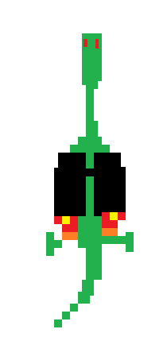

# RoadMap (du super jeu vidéo pour la Ludum Dare extended)

Remake de https://en.wikipedia.org/wiki/Asteroids_(video_game)

Thème: Delay the inevitable.

Idée orginale:

On contrôlerait un dino en jetpack avec par exemple des yeux qui envoient des lasers (le dernier espoir pour la terre).
On essaie de se rendre jusqu'à une comète en évitant des champs d'astéroïdes.
Quand on arrive à bout d'une comète, il en respawne une autre, et ça devient à chaque fois plus difficile (de plus en plus rapides et proches de la terre ?) Il pourrait y avoir d'autres difficultés.
Au final la comète s'abat sur terre, et c'est comme ça que disparaissent les dinosaures.
Avec une mini intro (un texte, quelques images) pour expliquer le contexte et une animation avec le crash de fin.

Identité visuelle : des formes géométriques simples avec rapier et couleur primaires.

Notre dino:

Post-processing: pixellisation (+ aberation chromatique ?)

## 9-14 Avril

Yvan:

- [ ] Faire bouger le fond quand le dino s'approche de l'un des bords (restreindre le dino dans un rectangle un peu réduit par rapport à l'écran)
- [ ] Les astéroïdes (un gros paquet de triangles qui se subdivise)
- [ ] camera dynamique, en cas de dégât : trembler
- [ ] Barre de vie / Barre de score (nombre d'astéroïdes détruit ? (+ score de l'astéroïde == taille) temps de survie (+1/s) ?)
- [ ] Ecran "Game Over"

Denis:

- [ ] level design : générer et faire arriver des astéroides de façon progressive (taille + fréquence)
- [ ] Animer le lancer de laser ? (épaisseur peut varier avec du bruit pour montrer l'intensité du rayon)
- [ ] Est-ce que la rayon surchauffe ? à besoin de se recharger ? ou ...
- [ ] Lvl-up à chaque météore explosé ? -> rayon plus puissant ? (barre de rayon)
- [ ] JetPack generateur de particule

## 15-21 Avril

Yvan:

- [ ] Le post-processing (rendu pixellisé)
- [ ] Menu: Un joli écran titre / high score ?

Denis:

- [ ] Mini animation (contexte presentation de la comète) / histoire lancement de jeu
- [ ] Réfléchir à un gameplay pour la comète (afficher le score sur une barre de progression)

## Deadline 21 Avril

https://ldjam.com/events/ludum-dare/50/$276398/extra-the-new-casual-ludum-dare-format
